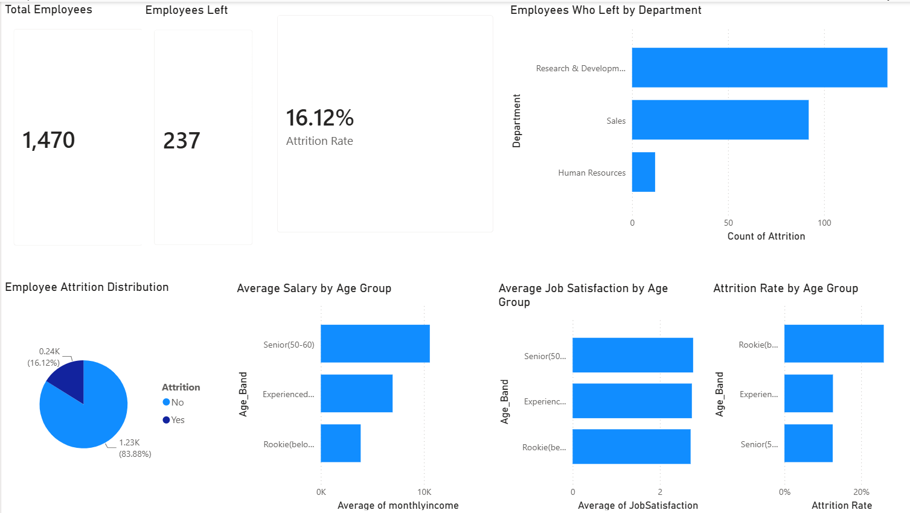

# Employee Attrition Analysis

## Project Overview

This project analyzes employee attrition data to identify factors associated with employee turnover. The analysis was performed using AWS RDS, MySQL, Python (Pandas), and Power BI to explore patterns in employee exits and generate business insights.

## Objectives

* Calculate the overall employee attrition rate.
* Compare attrition across different age groups.
* Analyze the relationship between salary and attrition.
* Examine job satisfaction levels across employee groups.
* Identify departments with the highest employee turnover.
* Build an interactive Power BI dashboard for business reporting.

## Tools & Technologies

* AWS RDS (MySQL Database)
* MySQL
* Python
* Pandas
* Power BI
* Jupyter Notebook

## Data Pipeline

1. Employee data stored in AWS RDS MySQL database.
2. Connected to the database using Python and PyMySQL.
3. Queried relevant employee information using SQL.
4. Loaded data into Pandas for cleaning and analysis.
5. Exported processed data for visualization.
6. Created an interactive dashboard in Power BI.

## Key Findings

* Overall attrition rate was 16.12%.
* Employees aged below 30 (Rookie employees) showed the highest attrition rate.
* Salary showed a stronger association with attrition than job satisfaction.
* Research & Development and Sales departments experienced the highest number of employee exits.
* Average job satisfaction remained relatively similar across age groups, suggesting it was not a major factor in explaining higher attrition among younger employees.

## Dashboard Metrics

* Total Employees
* Employees Left
* Attrition Rate
* Attrition by Age Group
* Average Monthly Income by Age Group
* Average Job Satisfaction by Age Group
* Attrition by Department## Dashboard Preview

## Limitations

This analysis focused on age, salary, department, overtime, and job satisfaction. Other factors such as distance from home, years at company, work-life balance, and career growth opportunities were not included in this analysis and may also influence employee attrition.

## Repository Contents

* Employee Attrition Dashboard.pbix
* employee_attrition.ipynb
* employee_attrition_analysis.csv

## Conclusion

The analysis indicates that younger employees experience higher attrition rates compared to other age groups. Compensation appears to have a stronger relationship with attrition than job satisfaction, suggesting that salary may be an important factor influencing employee retention.
